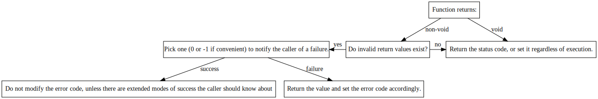

*This document serves to lay out the basic code guidelines for FMCB. That includes syntax style, code style, and other various conventions. This is by no means a comprehensive list, and is expected to be expanded upon over time. In general, if something is not listed here, try to infer style from the code around you.*

*If you have a question about the guidelines, feel free to ask a question on the project discussion page. If you think something here should be changed, you may open an issue and we will consider it.*

# Documentation

All classes and functions should be documented with a single, Doxygen style, multi-line comment. Each line in a documentation block should be prefixed by a `*`. Until the codebase is stable, however, code with a clear purpose can be left undocumented, though `// TODO: Documentation` should be left in it's place. Single-line comments can be placed at your discretion.

Speaking of `TODO`, there are several comment prefixes you should use:

- `TODO`: Let people know that something is unfinished.

  Eg: `// TODO: Do something`

- `?`: Ask a question about something. If you come across a question that you can answer, you may do so, and make a decision on what to do next. For example, if you came across `// ? Is this safe?`, and you find the answer to be no, you might want to change it to `// TODO: Make this safe` or simply fix it if you feel you can.

  Eg: `// ? Is this right?`

- `!`: A critical comment or bug.

  Eg: `// ! This can corrupt memory`

These prefixes should not be used in documentation blocks.

Additionally, if you are using VSCode, you can get highlighting for these prefixes by using the [Better Comments](https://marketplace.visualstudio.com/items?itemName=aaron-bond.better-comments) extension.

# Syntax

Trying to write down every little syntax rule here would be counterproductive; not only would the list be massive, but there will always be edge cases where you will have to make your own judgements.

That being said, we can include some basics.

- #### Whitespace

  This is a fairly large point. Instead of trying to make an in-depth rulebook, just try to follow the style of this general example:

  ```c++
  #include <iostream>
  
  class Rect {
  public:
  	Rect(int width, int height) {
  		W = width;
  		H = height;
  	}
  
  	int getArea() {
  		return W * H;
  	}
  
  private:
  	int W;
  	int H;
  };
  
  int main() {
  	// Alternatively:
  	// Rect rect[3] = {Rect(2, 3), Rect(5, 1), Rect(6, 3)};
  	Rect rect[3] = {
  		Rect(2, 3),
  		Rect(5, 1),
  		Rect(6, 3)
  	};
  
  	for (int i = 0; i < 3; i++) {
  		if (rect[i].getArea() > 0) {
  			std::cout << "Area is valid" << std::endl;
  		} else {
  			std::cout << "Area is invalid" << std::endl;
  		}
  	}
  
  	return 0;
  }
  ```

  For some additional pointers, mathematical expressions should always have spaces around operators, unless the expression is especially long, and omitting the whitespace would provide better readability. Vertical whitespace should be used to separate ideas, and shouldn't be applied based on any hard rule.

- #### Naming

  This rule should be followed very closely. If a conflict arises, we'd rather change the rule than have an inconsistent one.

  - Classes: camel case, with the first letter being upper case.

    Eg: `LinkedList`

  - Variables/Functions/Arguments: camel case, with the first letter being lower case.

    Eg: `nameLength`

  - Constants: same as variables, though with the first letter being `k`.

    Eg: `kErrorSuccess`

  - Macros: all capital snake case.

    Eg: `ERROR_SUCCESS`

  - Namespaces: snake case.

    Eg: `program_defaults`

  

# Style

- #### Dependencies

  We would like to keep the project as self-contained as possible, it is very likely that we will deny an addition that introduces a new dependency. That's not to say we won't use any; for example, OpenSSL is planned to be used as an aid in network security, but for many things, we'd rather just implement it ourselves.

- #### Feature usage

  Don't be afraid to use new C++ features. We build using C++17, and may switch to C++20 sometime in the future. Feel free to use any tools at your disposal, though try to refrain from using extensions to the standard unless you have a good reason.

- #### **Priorities**

  Don't follow a strict organization of priorities, write code as you feel is appropriate. That being said, we do have a *very* loose hierarchy, that being:

  1. Maintainability
  2. Runtime Efficiency
  3. Functionality
  4. Readability
  5. Compile Time

  Again though, this should not be a strict list. Don't make something unreadable for a 1% performance improvement (and vice versa), don't add a small bit of extra functionality for a large performance hit. you get the idea.

  Performance is important to us though; please don't use `std::shared_ptr` just because you can, `std::array` just because it exists. Use these where it is appropriate, not as a replacement for other types.

# Error Handling

Errors are mainly communicated and checked using the  `status` variable contained in `/server/Status.h`. C++ exceptions are also allowed, as long as they follow the rules below.

- #### Errors

  *Status codes should not be used in areas that would only fail as a result of a larger issue (the client database being corrupted, the input parameters not following preconditions, etc). Additionally, preconditions should be documented if doing so would negate the use of error setting and would not complicate the caller.*

  `Status.h` contains a master error enumerator named `Status`, and a variable of type `Status` named `status`, which holds the last set error.

  The values of `Status` follow the chart below:

  | Value | Meaning                   |
  | ----- | ------------------------- |
  | < 0   | Failure                   |
  | = 0   | Success                   |
  | > 0   | Extended Success (unused) |

  The extended success section is not used by `Status`, and each function can decide what those values correspond to.

  *Errors should not be propagated through applications, they should be handled locally. That being said, applications should communicate the result of important transactions to each other; each transaction should contain a status code (`std::int32_t` unless there is a good reason to do otherwise), the meaning of which should be specified by an enumerator defined by the server.*

  To throw an error, follow the diagram below.

  

  When checking errors, do so efficiently; the expected case should have a fast execution path.

  Errors do not have to be handled immediately, they can be passed on (as long as it is documented).

- #### Exceptions

  *Exceptions are allowed for exceptional cases only and should be used **sparingly**. They should be used in cases where a very rare (critical) failure can occur in which it is possible to recover from, or at least handle in some capacity.*

  *Exceptions are used with the assumption that the implementation is zero-cost.*

  Try to batch exception handling code into the same areas as much as possible. Place where it would work the best, but if given a choice, prefer to keep the codebase easy to understand.

